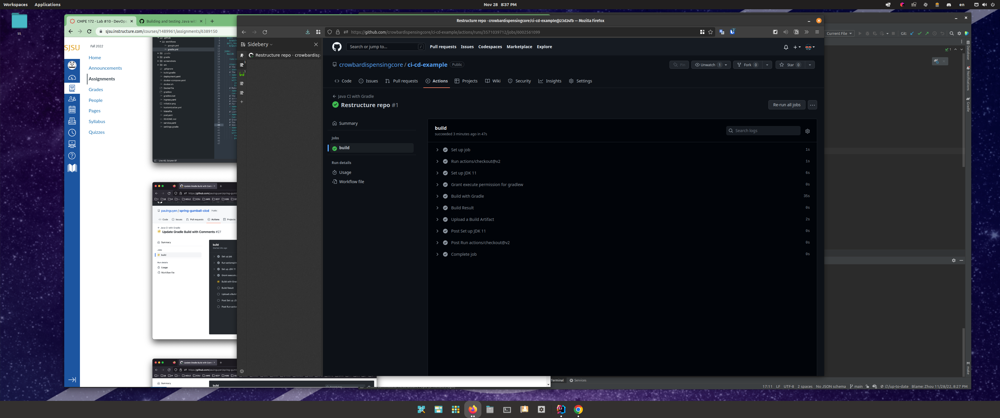

# spring-gumball ci/cd example

### This example demonstrates the following two GitHub Workflows.

* https://help.github.com/actions/language-and-framework-guides/building-and-testing-java-with-gradle

* https://github.com/google-github-actions/setup-gcloud/tree/master/example-workflows/gke

### Build Dependencies

* Gradle 5.6
* JDK 11

# Screenshots

# CI

## GitHub action config: gradle.yml

## GitHub CI action running

# CD

## Create cluster

## Enable APIs

## Project ID

## Create service account

## Grant accesses

## Create private key

## Create GitHub Secrets

## GitHub action config: google.yml

## kustomization.yml

## service.yml

## deployment.yml

## Create GitHub release

## GitHub CD action running

## Deployed workload

## Deployed service

## Create Ingress

## Visit frontend

